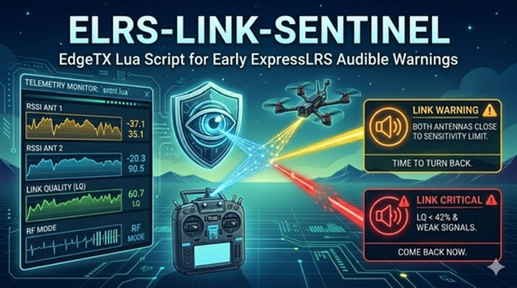

# elrs-link-sentinel



A small EdgeTX Lua script that watches your ExpressLRS link in the background and audibly warns you **before** the connection breaks down.

## What is it for?

With ELRS, the usable range depends heavily on the selected RF mode (packet rate). Each mode has its own receiver sensitivity limit. If you don't keep a constant eye on a live telemetry screen, you usually only notice a weakening link when it's already too late.

`sntnl.lua` reads the receiver's telemetry values (RSSI of both antennas, link quality, current RF mode) and plays two graded warning tones:

- **Link Warning** – The receiver's antenna(s) are close to the sensitivity limit of the current mode. On a dual-antenna receiver both antennas have to drop below the threshold; a single-antenna receiver is evaluated on its only RSSI value. *"Time to turn back toward the pilot."*
- **Link Critical** – Same RSSI condition as above **and** packets are starting to drop (RQly < 42 %). *"Come back now."*

If telemetry is lost completely, the script intentionally stays silent — EdgeTX itself already raises an alarm in that case.

## Requirements

- A radio running EdgeTX
- An ExpressLRS receiver running firmware 4.0 or newer with telemetry enabled
- The following ELRS telemetry sensors must be discovered on the radio: `RFMD`, `1RSS`, `RQly` and — on dual-antenna receivers — `2RSS` (they appear automatically after a telemetry discovery)

## Installation

### 1. Copy the files to the SD card

Take the SD card out of the radio (or connect the radio via USB as mass storage) and create the following structure:

```
SCRIPTS/
└── FUNCTIONS/
    ├── sntnl.lua
    └── sntnl/
        ├── stage1.wav
        └── stage2.wav
```

All three files are available in the `SCRIPTS/FUNCTIONS/` folder of this repository — just copy them 1:1 to the same location on the SD card.

### 2. Set up a Special Function on the model

1. Put the SD card back into the radio and switch it on.
2. Open the **Model Settings** of the desired model and go to the **Special Functions** (also called "SF") page.
3. Pick a free slot and configure it as follows:
   - **Switch / Condition:** `On` (the script runs permanently in the background)
   - **Action:** `Lua Script`
   - **Value / Script:** `sntnl`
   - **Repeat:** `On`
   - **Enable:** `On`
4. Save the settings.

### 3. Test it

- Bind the model and verify telemetry (RSSI values and RQly must show up on the radio).
- When you intentionally weaken the link (e.g. move the model away, cover an antenna), the first warning tone should play after about 2 seconds and repeat every 5 seconds.
- With a very weak link **and** packet loss the script automatically switches to the critical warning tone.

## Customizing

If you want to tweak the thresholds or timings, open `sntnl.lua` in a text editor. The first lines of the script define four constants:

| Constant          | Default | Meaning                                              |
|-------------------|---------|------------------------------------------------------|
| `WARN_OFFSET_DB`  | `10`    | Margin above the sensitivity limit (dBm) that triggers a warning |
| `RQLY_THRESHOLD`  | `42`    | RQly threshold in % for the critical warning        |
| `DEBOUNCE_MS`     | `2000`  | How long the condition must hold (ms)               |
| `REPEAT_MS`       | `5000`  | Gap between two warning tones (ms)                  |

After saving, copy the file back to the SD card — no reboot needed; EdgeTX reloads the script the next time the model is activated.

### Replacing the warning sounds

If you don't like the supplied tones, feel free to drop in your own audio files. Just keep the file names exactly as they are — `stage1.wav` for the warning and `stage2.wav` for the critical alert — and leave them in the `/SCRIPTS/FUNCTIONS/sntnl/` folder.

## Troubleshooting

- **Script doesn't show up when picking it for the Special Function:** Check the file name — it must be exactly `sntnl.lua` (max. 6 characters, otherwise EdgeTX hides function scripts).
- **No warning tone is ever played:** Make sure the WAV files really sit in `/SCRIPTS/FUNCTIONS/sntnl/` and not directly in the `FUNCTIONS` folder.
- **Permanent warning despite good reception:** Your ELRS setup is probably using a mode whose sensitivity limit isn't yet listed in the script. Please [open an issue](../../issues) so it can be added.

## Contributing

Found a bug, have an idea for an improvement, or running an ELRS mode that isn't covered yet? Please [open an issue](../../issues) on GitHub. Pull requests are welcome too.

## Disclaimer

This script is provided **as is** and is intended as an additional aid only. It does **not** replace careful flying within visual range, your own judgement, or the safety mechanisms of your transmitter and receiver. Always be ready to react manually. Use at your own risk.

## License

Released under the [MIT License](LICENSE).
