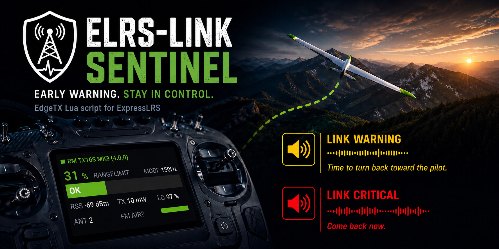

# elrs-link-sentinel



A small EdgeTX project that watches your ExpressLRS link in the background and audibly warns you **before** the connection breaks down. It ships in two interchangeable flavors: a tiny **function script** (audio only) and a **color widget** (the same audio warnings *plus* a live link display).

[](LICENSE)
[](https://edgetx.org)
[](https://www.expresslrs.org)
[](../../issues)
[](../../commits/main)

---

## 📑 Table of Contents

- [📋 Compatibility](#-compatibility)
- [🎯 What is it for?](#-what-is-it-for)
- [🧩 Script variants](#-script-variants)
- [🧰 Requirements](#-requirements)
- [📥 Installation](#-installation)
- [⚙️ Customizing](#️-customizing)
- [🛠️ Troubleshooting](#️-troubleshooting)
- [💡 Credits](#-credits)
- [🤝 Contributing](#-contributing)
- [⚠️ Disclaimer](#️-disclaimer)
- [📄 License](#-license)

---

## 📋 Compatibility

| Component | Minimum Version | Tested On | Test Hardware |
|-----------|-----------------|-----------|---------------|
| EdgeTX    | v2.10           | v2.12.0   | Radiomaster TX15, Radiomaster TX16S MK3 |
| ExpressLRS| v4.0.0          | v4.0.0    | Radiomaster RP1 V2, RP3 V2, RP4TD |

---

## 🎯 What is it for?

With ELRS, the usable range depends heavily on the selected RF mode (packet rate). Each mode has its own receiver sensitivity limit. If you don't keep a constant eye on a live telemetry screen, you usually only notice a weakening link when it's already too late.

The sentinel reads the receiver's telemetry values (RSSI of both antennas, link quality, current RF mode) and plays two graded warning tones:

- **Link Warning:** The antenna(s) are near the current mode's sensitivity limit. *"Time to turn back toward the pilot."*
- **Link Critical:** Same condition, plus packets starting to drop (RQly < 42 %). *"Come back now."*

If telemetry is lost completely, the sentinel intentionally stays silent, because EdgeTX itself already raises an alarm in that case.

If telemetry is up but the required sensors (`RFMD`, `1RSS`, `RQly`) never show up, it plays a separate **configuration-error tone** so you know it cannot warn you. The tone repeats every 30 seconds until the sensors appear.

---

## 🧩 Script variants

The warning logic lives in a shared core module (`core.lua`). On top of it sit two wrappers — **pick exactly one**:

| | **Function script** | **Widget** |
|---|---|---|
| Audible warnings | ✅ | ✅ |
| Visual link display | — | ✅ (range %, RF mode, RSSI, LQ, TX power, FC flight mode, active antenna, ELRS module + firmware) |
| Runs in the background | ✅ (Special Function) | ✅ (keeps warning even when the screen is not shown) |
| Supported radios | all EdgeTX radios | color-display radios only |

> ⚠️ **Don't install both at the same time** — they would play the warning tones twice. The widget fully replaces the function script.

Both variants need `core.lua` on the SD card — it holds the shared warning logic, so audio and display always stay in sync.

---

## 🧰 Requirements

- A radio running EdgeTX (color display required for the widget variant)
- An ExpressLRS receiver running firmware 4.0 or newer with telemetry enabled
- The following ELRS telemetry sensors must be discovered on the radio (they appear automatically after a telemetry discovery):
  - **Mandatory:** `RFMD`, `1RSS`, `RQly`
  - **Dual-antenna receivers:** `2RSS`
  - **Widget display only (optional):** `ANT`, `TPWR`, `FM` — shown when present

---

## 📥 Installation

### 1. Copy the files to the SD card

Take the SD card out of the radio (or connect the radio via USB as mass storage). Just copy everything below 1:1 — it does no harm to have both variants on the card. You then pick which one to use later by **either** activating the widget **or** adding the function script to a Special Function (just not both, see [Script variants](#-script-variants)):

```
SCRIPTS/
├── SNTNL/
│   └── core.lua            ← shared logic (used by both variants)
└── FUNCTIONS/
    └── sntnl.lua           ← function-script variant
WIDGETS/
└── SNTNL/
    └── main.lua            ← widget variant
SOUNDS/
└── en/
    └── SCRIPTS/
        └── SNTNL/
            ├── stage1.wav
            ├── stage2.wav
            └── cfgerr.wav
```

All files are available in the matching folders of this repository — just copy them to the same locations on the SD card. The WAV files always live under `/SOUNDS/en/SCRIPTS/SNTNL/` regardless of the radio's language setting; the script uses an absolute path to play them.

### 2a. Set up the function script (Special Function)

1. Put the SD card back into the radio and switch it on.
2. Open the **Model Settings** of the desired model and go to the **Special Functions** (also called "SF") page.
3. Pick a free slot and configure it as follows:
   - **Switch / Condition:** `On` (the script runs permanently in the background)
   - **Action:** `Lua Script`
   - **Value / Script:** `sntnl`
   - **Repeat:** `On`
   - **Enable:** `On`
4. Save the settings.

### 2b. *(Alternative)* Set up the widget

1. Put the SD card back into the radio and switch it on.
2. Open the model's **Telemetry / Display** (widget screens) configuration.
3. Add a widget to a free zone and pick **Sentinel** from the list.
4. *(Optional)* Open the widget settings to adjust:
   - **Theme** — `Dark` / `Light`.
   - **Transparency** — milky-overlay transparency level (light theme only).
   - **TxtColor** — color of the heading / brand text: `Default` (the classic green), `Theme` (the focus color of your active EdgeTX theme), or `Custom` (pick any color via **CustomCol**).

> 📐 **Recommended screen layouts:** EdgeTX names its widget-screen layouts `columns × rows` (e.g. `2×4` = 2 columns next to each other, 4 rows on top of each other → 8 zones). The Sentinel widget is designed for a **half-width** zone, so it looks best in the layouts with **2 columns**:
>
> - **2×2** — half width, half height (the quarter-tile). This is the primary use case and shows the full layout with every value.
> - **2×3** — half width, one third height. Slightly shorter, so the widget automatically switches to a more compact layout.
> - **2×4** — half width, one quarter height. The shortest supported zone; it falls back to the most compact layout to stay readable.

### 3. Test it

- Bind the model and verify telemetry (RSSI values and RQly must show up on the radio).
- When you intentionally weaken the link (e.g. move the model away, cover an antenna), the first warning tone should play after about 2 seconds and repeat every 5 seconds.
- With a very weak link **and** packet loss the sentinel automatically switches to the critical warning tone.
- On the widget, the range bar fills towards 100 % and changes color (green → yellow → red) in lockstep with the audio warning.

---

## ⚙️ Customizing

All tunable parameters live in **one place** — the `M.PARAMS` table near the top of `/SCRIPTS/SNTNL/core.lua`. Open it in a text editor; both variants pick up the change automatically:

| Constant            | Default | Meaning                                                          |
|---------------------|---------|------------------------------------------------------------------|
| `WARN_OFFSET_DB`    | `10`    | Margin above the sensitivity limit (dBm) that triggers a warning |
| `RQLY_THRESHOLD`    | `42`    | RQly threshold in % for the critical warning                     |
| `DEBOUNCE_MS`       | `2000`  | How long the condition must hold before (de)activating (ms)      |
| `REPEAT_MS`         | `5000`  | Gap between two warning tones (ms)                               |

After saving, copy the file back to the SD card. No reboot needed; EdgeTX reloads the script the next time the model is activated.

### Replacing the warning sounds

If you don't like the supplied tones, feel free to drop in your own audio files. Just keep the file names exactly as they are (`stage1.wav` for the warning, `stage2.wav` for the critical alert, `cfgerr.wav` for the configuration-error tone) and leave them in the `/SOUNDS/en/SCRIPTS/SNTNL/` folder.

---

## 🛠️ Troubleshooting

- **Script doesn't show up when picking it for the Special Function:** Check the file name. It must be exactly `sntnl.lua` (max. 6 characters, otherwise EdgeTX hides function scripts).
- **Widget shows "Core missing / Reinstall SNTNL", or the function script errors on load:** `core.lua` is not where it should be. Make sure `/SCRIPTS/SNTNL/core.lua` exists on the SD card — both variants depend on it.
- **Widget shows "Sensor missing / Discover in EdgeTX" (and the config-error tone plays):** One of the mandatory sensors (`RFMD`, `1RSS`, `RQly`) is missing. Run a telemetry discovery on the radio while the link is up.
- **No warning tone is ever played:** Make sure the WAV files really sit in `/SOUNDS/en/SCRIPTS/SNTNL/` (the `en/` folder is mandatory even if your radio is set to another language).
- **Permanent warning / range shows "--" despite good reception:** Your ELRS setup is probably using a mode whose sensitivity limit isn't yet listed in `core.lua`. Please [open an issue](../../issues) so it can be added.

---

## 💡 Credits

The idea for this script comes from the RC Video Reviews YouTube video ["Express LRS Link Telemetry • How-to Setup Your Radio Correctly"](https://www.youtube.com/watch?v=sl68I-MoJ9Q).

---

## 🤝 Contributing

Found a bug, have an idea for an improvement, or running an ELRS mode that isn't covered yet? Please [open an issue](../../issues) on GitHub. Pull requests are welcome too.

---

## ⚠️ Disclaimer

This project is provided **as is** and is intended as an additional aid only. It does **not** replace careful flying within visual range, your own judgement, or the safety mechanisms of your transmitter and receiver. Always be ready to react manually. Use at your own risk.

---

## 📄 License

Released under the [GNU General Public License v2.0](LICENSE).