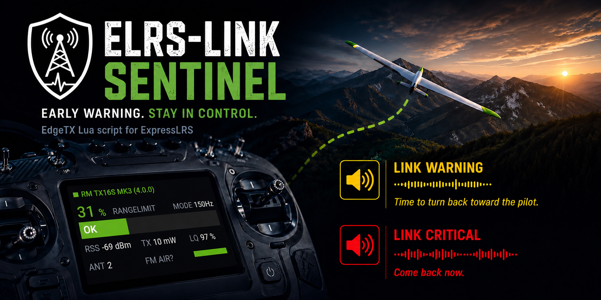
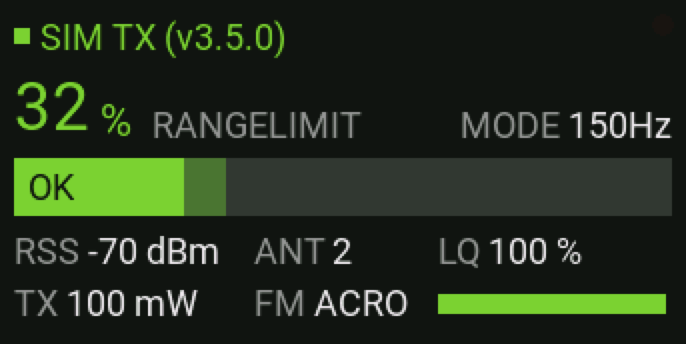
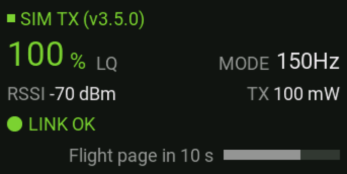
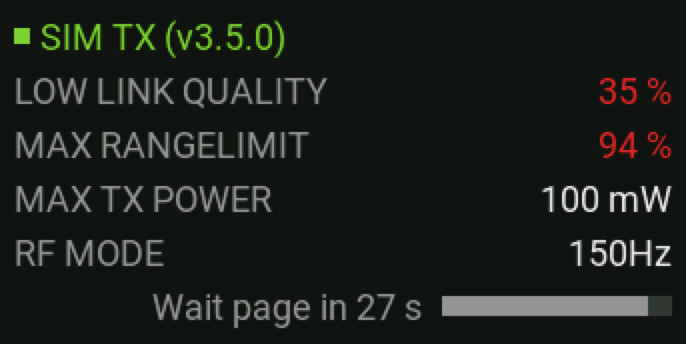

# elrs-link-sentinel



A small EdgeTX project that watches your ExpressLRS link in the background and audibly warns you **before** the connection breaks down. It ships in two interchangeable flavors: a tiny **function script** (audio only) and a **color widget** (the same audio warnings *plus* a live link display).

[](LICENSE)
[](https://edgetx.org)
[](https://www.expresslrs.org)
[](../../issues)
[](../../commits/main)
[](https://www.buymeacoffee.com/mariatorpro)

---

## 📑 Table of Contents

- [📋 Compatibility](#-compatibility)
- [🎯 What is it for?](#-what-is-it-for)
- [🧩 Script variants](#-script-variants)
- [🧰 Requirements](#-requirements)
- [📥 Installation](#-installation)
- [⚙️ Customizing](#️-customizing)
- [🛠️ Troubleshooting](#️-troubleshooting)
- [💡 Credits](#-credits)
- [🤝 Contributing](#-contributing)
- [⚠️ Disclaimer](#️-disclaimer)
- [📄 License](#-license)

---

## 📋 Compatibility

| Component | Minimum Version | Tested On | Test Hardware |
|-----------|-----------------|-----------|---------------|
| EdgeTX    | v2.11           | v2.12.4   | Radiomaster TX15, Radiomaster TX16S MK3 |
| ExpressLRS| v4.0.0          | v4.1.0    | Radiomaster RP1 V2, RP3 V2, RP4TD |

> Flight controllers (Betaflight, INAV, ArduPilot) and the settings they need: see [`docs/compatibility.md`](docs/compatibility.md).
>
> 🙋 **Help wanted:** INAV and ArduPilot are not tested on real hardware yet. If you fly one of them, a test would help a lot. Any feedback, working or not, is welcome: please [open an issue](../../issues).

---

## 🎯 What is it for?

With ELRS, the usable range depends heavily on the selected RF mode (packet rate). Each mode has its own receiver sensitivity limit. If you don't keep a constant eye on a live telemetry screen, you usually only notice a weakening link when it's already too late.

<p align="center">
  
</p>

The sentinel reads the receiver's telemetry values (RSSI of both antennas, link quality, current RF mode) and plays two graded warning tones:

- **Link Warning:** The antenna(s) are near the current mode's sensitivity limit. *"Time to turn back toward the pilot."*
- **Link Critical:** Same condition, plus packets starting to drop (RQly < 42 %). *"Come back now."*

If telemetry is lost completely, the sentinel stays silent by default, because EdgeTX itself already raises an alarm in that case. Optional **Link lost**, **Link connected** and **Link recovered** announcements can be switched on in the settings.

If telemetry is up but the required sensors (`RFMD`, `1RSS`, `RQly`) never show up, it plays a separate **configuration-error tone** so you know it cannot warn you. The tone repeats every 30 seconds until the sensors appear.

Besides the flight view above, the widget shows a page for each other phase of a flight:

<table>
  <tr>
    <td align="center"></td>
    <td align="center"></td>
    <td align="center"></td>
  </tr>
  <tr>
    <td align="center"><b>Waiting</b><br>no receiver connected</td>
    <td align="center"><b>Preflight</b><br>link check before take-off</td>
    <td align="center"><b>End</b><br>the flight's link extremes</td>
  </tr>
</table>

---

## 🧩 Script variants

The warning logic lives in a shared core module (`core.lua`). On top of it sit two wrappers, and you install **exactly one** of them:

<table>
  <thead>
    <tr>
      <th width="24%"></th>
      <th width="38%">Function script</th>
      <th width="38%">Widget</th>
    </tr>
  </thead>
  <tbody>
    <tr>
      <td>Audible warnings</td>
      <td>✅</td>
      <td>✅</td>
    </tr>
    <tr>
      <td>Visual link display</td>
      <td>❌</td>
      <td>✅ (range %, RF mode, RSSI, LQ, TX power, FC flight mode, active antenna, ELRS module + firmware)</td>
    </tr>
    <tr>
      <td>Runs in the background</td>
      <td>✅ (Special Function)</td>
      <td>✅ (keeps warning even when the screen is not shown)</td>
    </tr>
    <tr>
      <td>Supported radios</td>
      <td>all EdgeTX radios</td>
      <td>color-display radios only</td>
    </tr>
  </tbody>
</table>

> ⚠️ **Don't install both at the same time**, or they would play the warning tones twice. The widget fully replaces the function script. For the same reason, place the widget on **one screen only**.

Both variants need `core.lua` on the SD card, because it holds the shared warning logic that keeps audio and display in sync.

---

## 🧰 Requirements

- A radio running EdgeTX (color display required for the widget variant)
- An ExpressLRS receiver running firmware 4.0 or newer with telemetry enabled
- The following ELRS telemetry sensors must be discovered on the radio (they appear automatically after a telemetry discovery):
  - **Mandatory:** `RFMD`, `1RSS`, `RQly`
  - **Dual-antenna receivers:** `2RSS`
  - **Widget display only (optional):** `ANT`, `TPWR`, `FM` (shown when present). `FM` also tells the widget when the model is armed (switches to the flight view at once, flight values only while armed).

---

## 📥 Installation

### 1. Copy the files to the SD card

Take the SD card out of the radio (or connect the radio via USB as mass storage). Just copy everything below 1:1, since it does no harm to have both variants on the card. You then pick which one to use later by **either** activating the widget **or** adding the function script to a Special Function (just not both, see [Script variants](#-script-variants)):

```
SCRIPTS/
├── SNTNL/
│   ├── core.lua            ← shared logic
│   └── manifest.lua        ← Flight Bag settings
├── FUNCTIONS/
│   └── sntnl.lua           ← function script
├── FLIGHTBAG/              ← Flight Bag pages
└── TOOLS/
    └── FLIGHTBAG.lua       ← Tools menu entry
WIDGETS/
└── SNTNL/
    └── main.lua            ← widget
SOUNDS/
└── en/
    └── SCRIPTS/
        └── SNTNL/          ← all .wav files
```

All files are available in the matching folders of this repository, so just copy them to the same locations on the SD card. The WAV files always live under `/SOUNDS/en/SCRIPTS/SNTNL/` regardless of the radio's language setting; the script uses an absolute path to play them.

### 2a. Set up the function script (Special Function)

1. Put the SD card back into the radio and switch it on.
2. Open the **Model Settings** of the desired model and go to the **Special Functions** (also called "SF") page.
3. Pick a free slot and configure it as follows:
   - **Switch / Condition:** `On` (the script runs permanently in the background)
   - **Action:** `Lua Script`
   - **Value / Script:** `sntnl`
   - **Repeat:** `On`
   - **Enable:** `On`
4. Save the settings.

### 2b. *(Alternative)* Set up the widget

1. Put the SD card back into the radio and switch it on.
2. Open the model's **Telemetry / Display** (widget screens) configuration.
3. Add a widget to a free zone and pick **Sentinel** from the list.
4. *(Optional)* Open the widget settings to adjust:
   - **Theme**: `Dark` / `Light`.
   - **Transparency**: how much of the radio theme shows through the milky background (light theme only): `0%` opaque, `100%` no overlay.
   - **Accent**: color of the heading / brand text: `Default` (the classic green), `Theme` (the focus color of your active EdgeTX theme), or `Custom` (pick any color via **AccentColor**).

> 📐 **Recommended screen layouts:** EdgeTX names its widget-screen layouts `columns × rows` (e.g. `2×4` = 2 columns next to each other, 4 rows on top of each other → 8 zones). The Sentinel widget is designed for a **half-width** zone, so it looks best in the layouts with **2 columns**:
>
> - **2×2**: half width, half height (the quarter-tile). This is the primary use case and shows the full layout with every value.
> - **2×3**: half width, one third height. Slightly shorter, so the widget automatically switches to a more compact layout.
> - **2×4**: half width, one quarter height. The shortest supported zone; it falls back to the most compact layout to stay readable.

### 3. Test it

- Bind the model and verify telemetry (RSSI values and RQly must show up on the radio).
- When you intentionally weaken the link (e.g. move the model away, cover an antenna), the first warning tone should play after about 2 seconds and repeat every 5 seconds.
- With a very weak link **and** packet loss the sentinel automatically switches to the critical warning tone.
- If you enabled haptic feedback, the radio vibrates together with each warning tone.
- Each warning switches a dimmed display back on (restarts the backlight timeout).
- On the widget, the range bar fills towards 100 % and changes color (green → yellow → red) in lockstep with the audio warning.
- Before the flight the widget shows a preflight page (LQ, mode, link status, RSSI, TX power). Once the link is OK, a bar at the bottom right counts down 15 s to the flight view; arming switches at once. After the flight (1.5 s without link) an end page shows the flight's lowest LQ, highest RANGELIMIT, highest TX power and the mode for 30 s.

---

## ⚙️ Customizing

Thresholds and sounds are set in **Flight Bag**, a settings tool shared by several EdgeTX scripts. Copy its files (see the file tree above) and open **SYS → Tools → Flight Bag**. After **Save**, changes apply within a few seconds for both variants, no restart needed.

Link Sentinel's rows sit under the heading **Link Sentinel**:

- **Warnings**
  - **Stage 1**: how early the first warning comes, as a margin above the RF mode's sensitivity limit. **10-30 dB** (default 10). Higher warns earlier.
  - **Stage 2**: the link quality (RQly) below which the warning turns critical. **30-70 %** (default 42). Higher warns earlier.
- **Alerts**
  - **Sounds**, **Vibration**, **Strength**: shared by all Flight Bag scripts. `Sounds Off` silences every Link Sentinel tone. Vibration (off by default) gives one pulse for Stage 1 and two for Stage 2, independent of the sound.
  - **Stage 1** / **Stage 2**: the tone per stage: `Off`, `Default` or any `.wav` you put into `/SOUNDS/en/SCRIPTS/SNTNL/`. **Play** previews it.
  - **Link lost**: `Off` by default. `Default` says "Radio link lost", `telelost.wav` says "Radio link telemetry lost". It plays once when the link is gone for 1.5 s during a flight, not after a disarm. Without `FM` from the flight controller it also plays when you unplug the battery after landing.
  - **Link connected**: `Off` by default. `Default` says "Radio link connected". It plays once when the link comes up for a new flight (model powered on).
  - **Link recovered**: `Off` by default. `Default` says "Radio link recovered". It plays once when the link comes back after it was lost during an armed flight.

Tap the **Link Sentinel** icon for **Reset settings** and the version. A warning sign on the icon means something needs attention (for example missing sensors or no settings file yet); the popup says what to do.

> **Updating from an older version?** Flight Bag removes the old "Link Sentinel" Tools entry on first start. If it still shows up, delete `/SCRIPTS/TOOLS/SNTNL.lua` by hand.

---

## 🛠️ Troubleshooting

- **Script doesn't show up when picking it for the Special Function:** Check the file name. It must be exactly `sntnl.lua` (max. 6 characters, otherwise EdgeTX hides function scripts).
- **Widget shows "Core missing / Reinstall Link Sentinel", or the function script errors on load:** `core.lua` is not where it should be. Make sure `/SCRIPTS/SNTNL/core.lua` exists on the SD card, since both variants depend on it.
- **Widget shows "Configuration error / Please check Tool Flight Bag" (and the config-error tone plays):** One of the mandatory sensors (`RFMD`, `1RSS`, `RQly`) is missing. Open **Tools → Flight Bag** and tap the Link Sentinel icon (it carries a warning sign): the popup names the missing sensors, e.g. `Missing sensors: RQly` / `Check sensors config`. Run a telemetry discovery on the radio while the link is up.
- **Widget shows `FM --` while everything else works:** The flight mode comes from the flight controller's telemetry, not from ExpressLRS. Warnings and the link display are not affected. Enable telemetry on the flight controller (INAV: `feature TELEMETRY`), see [`docs/compatibility.md`](docs/compatibility.md#setup).
- **No warning tone is ever played:** Make sure the WAV files really sit in `/SOUNDS/en/SCRIPTS/SNTNL/` (the `en/` folder is mandatory even if your radio is set to another language). The quickest check is Flight Bag: on the **Alerts** page dive into **Stage 1** or **Stage 2** and press **Play**, which confirms the file is found and your radio's volume is up.
- **Permanent warning / range shows "--" despite good reception:** Your ELRS setup is probably using a mode whose sensitivity limit isn't yet listed in `core.lua`. Please [open an issue](../../issues) so it can be added.

---

## 💡 Credits

The idea for this script comes from the RC Video Reviews YouTube video ["Express LRS Link Telemetry • How-to Setup Your Radio Correctly"](https://www.youtube.com/watch?v=sl68I-MoJ9Q).

---

## 🤝 Contributing

Found a bug, have an idea for an improvement, or running an ELRS mode that isn't covered yet? Please [open an issue](../../issues) on GitHub. Pull requests are welcome too.

---

## ⚠️ Disclaimer

This project is provided **as is** and is intended as an additional aid only. It does **not** replace careful flying within visual range, your own judgement, or the safety mechanisms of your transmitter and receiver. Always be ready to react manually. Use at your own risk.

---

## 📄 License

Released under the [GNU General Public License v2.0](LICENSE).